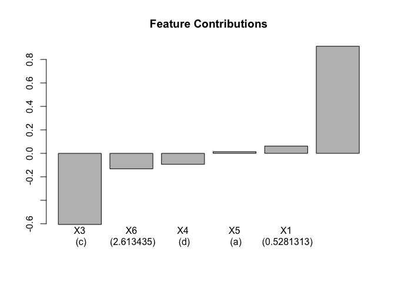

README
================

GbmExplainR
===========

Based off the [treeinterpreter](https://github.com/andosa/treeinterpreter) Python package, associated blog post [here](http://blog.datadive.net/random-forest-interpretation-conditional-feature-contributions/).

### Decompose gbm predictions into feature contributions

For a given prediction from a gbm, the feature contributions can be extracted;

    ##   variable contribution variable_value  variable_class
    ## 1       X3  -0.60616629              c ordered, factor
    ## 2       X2   0.91253704       1.960782         numeric
    ## 3       X1   0.06175009      0.5281313         numeric
    ## 4       X4  -0.09350021              d          factor
    ## 5       X6  -0.13187516       2.613435         numeric
    ## 6       X5   0.01415618              a          factor
    ## 7     Bias   2.83020505           <NA>              NA

These can be charted in a simple barchart;



### Tree structure and terminal node path

Individual trees can be plotted, and the route to a terminal node can be highlighted for a given observation.

``` r
plot_tree(gbm1, 1, data[1, ]) 
```


### Other similar works

-   [treeinterpreter](https://github.com/andosa/treeinterpreter) Python package implements prediction decomposition for decision tree, random forests and extra tree models in [scikit-learn](http://scikit-learn.org/stable/index.html)
-   [eli5](https://github.com/TeamHG-Memex/eli5) Python package contains an [explain\_predictions](http://eli5.readthedocs.io/en/latest/autodocs/eli5.html) function to do prediction decomposition for various models
-   [xgboostExplainer](https://github.com/AppliedDataSciencePartners/xgboostExplainer) implements prediction decomposition for [xgboost](https://github.com/dmlc/xgboost) models from R
