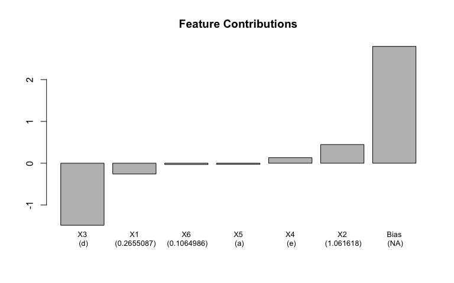

README
================

GbmExplainR
===========

GbmExplainR is a package to decompose gbm predictions into feature contributions. There is also functionality to plot individual trees from the models and the route for a given observation through the tree to a terminal node. GbmExplainR works with the [gbm](https://cran.r-project.org/web/packages/gbm/index.html) package.

GbmExplainR is based off the [treeinterpreter](https://github.com/andosa/treeinterpreter) Python package, there a blog post on treeinterpreter [here](http://blog.datadive.net/random-forest-interpretation-conditional-feature-contributions/).

### Decompose gbm predictions into feature contributions

Let's look at the predicted value from a gbm. Note this model is the first example from `?gbm`.

``` r
predict(gbm1, data[1, ], n.trees = gbm1$n.trees)
```

    ## [1] 1.575326

For a given prediction from a gbm, the feature contributions can be extracted;

``` r
decompose_gbm_prediction(gbm = gbm1, prediction_row = data[1, ])
```

    ##   variable contribution variable_value  variable_class
    ## 1       X3  -1.48439005              d ordered, factor
    ## 2       X2   0.44671068       1.061618         numeric
    ## 3       X1  -0.25693447      0.2655087         numeric
    ## 4       X4   0.13191849              e          factor
    ## 5       X6  -0.03038647      0.1064986         numeric
    ## 6       X5  -0.02561677              a          factor
    ## 7     Bias   2.79402449           <NA>              NA

Notice how the feature contributions sum to give the predicted value. <br> <br> These can be charted with a simple barchart;

``` r
plot_feature_contributions(feature_contributions = decompose_gbm_prediction(gbm1, data[1, ]),
                           cex.names = 0.8)
```



### Tree structure and terminal node path

Individual trees can be plotted, and the route to a terminal node can be highlighted for a given observation;

``` r
plot_tree(gbm = gbm1, 
          tree_no = 1, 
          plot_path = data[1, ], 
          edge.label.cex = 1.2,
          vertex.label.cex = 1.2) 
```


### Installation

Install form Github with devtools;

``` r
library(devtools)
devtools::install_github(richardangell/GbmExplainR)
```

### Other similar works

There are other similar packages in R and Python that implement the same method for a variety of tree based models;

-   [treeinterpreter](https://github.com/andosa/treeinterpreter) Python package implements prediction decomposition for decision tree, random forests and extra tree models in [scikit-learn](http://scikit-learn.org/stable/index.html)
-   [eli5](https://github.com/TeamHG-Memex/eli5) Python package contains an [explain\_predictions](http://eli5.readthedocs.io/en/latest/autodocs/eli5.html) function to do prediction decomposition for various models
-   [xgboostExplainer](https://github.com/AppliedDataSciencePartners/xgboostExplainer) implements prediction decomposition for [xgboost](https://github.com/dmlc/xgboost) models from R
